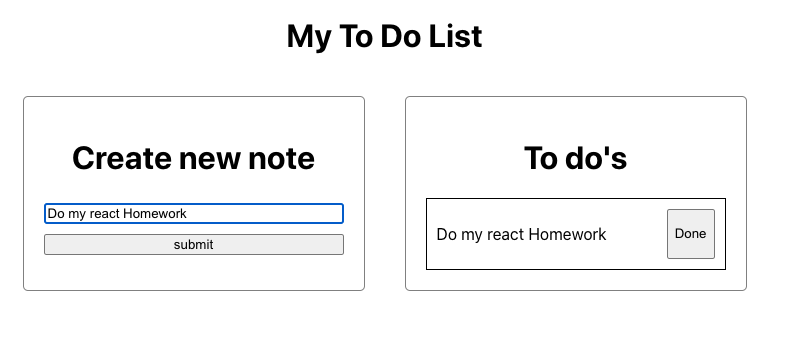
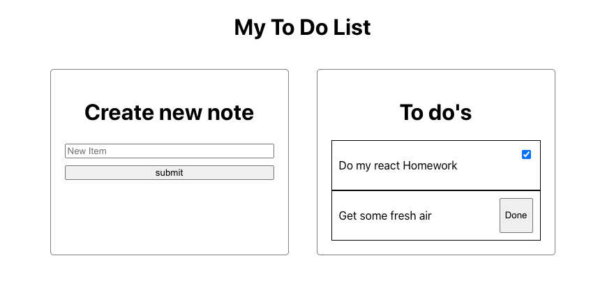
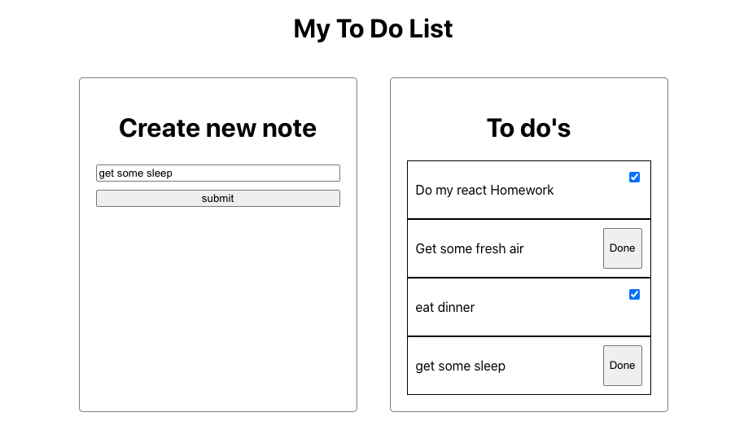

# React To Do List

## Goals

- Have a form with a single input that on submit, adds to your stack of to do list items
- Create a panel that displays all your items on your to do list
- For the existing to do list items, have a button that when clicked marks itself as done
- For the list items that are done, display a checkmark or indicator that it is done, otherwise do not display a checkmark (maybe conditional render?)

## Tips

- we'll probably want to have state that keeps track of all our todo list items (think similar to ingredients from burger stack)
- what do we want to have for each new note entry? (probably an object since the note needs to have a text key containing its text and a done key which should be initially false)

## Component Structure

- sample component structure
  - App
  - - FormPanel
      - Form
  - - TodoListPanel
      - ListItem

## Stretch Goals #1

- display the to do list items in order from undone first then all done items

## Stretch Goal #2

- instead of display items in order from undone to done, have another panel called done and when you mark an item as done, have that list item move over to the done section
